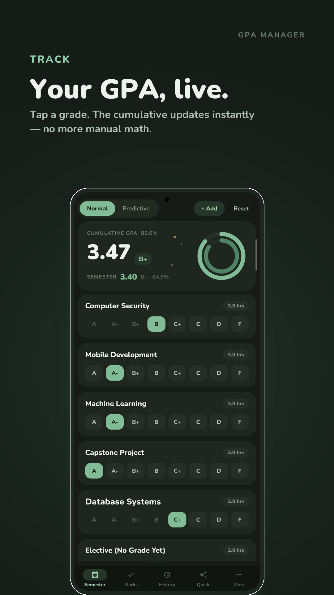
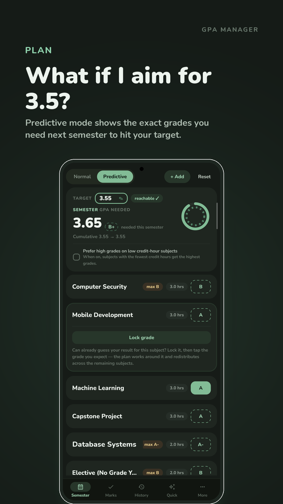
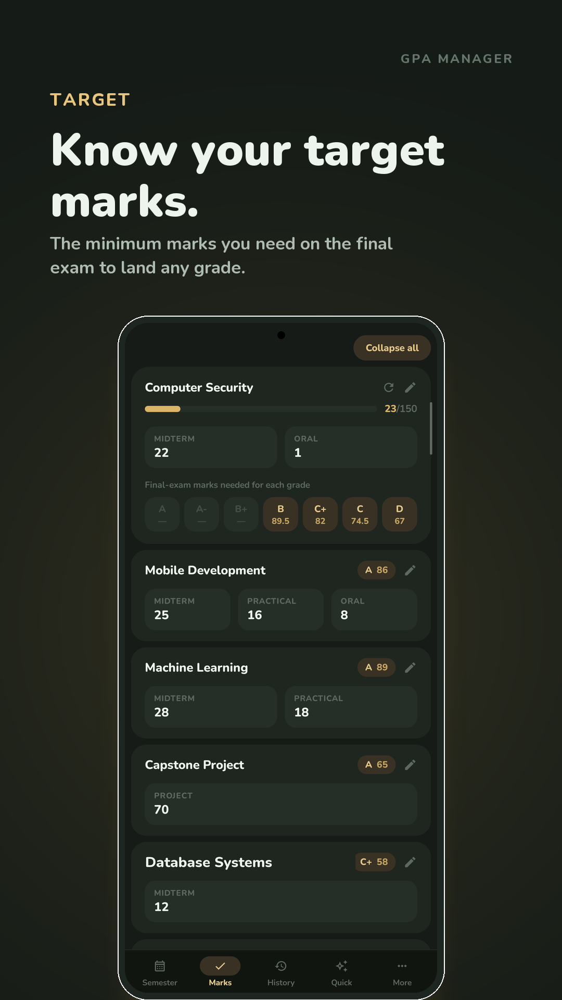
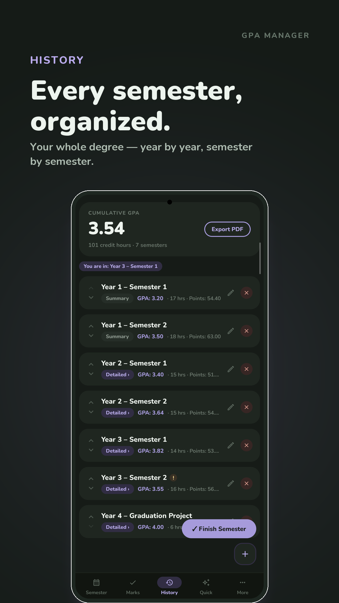
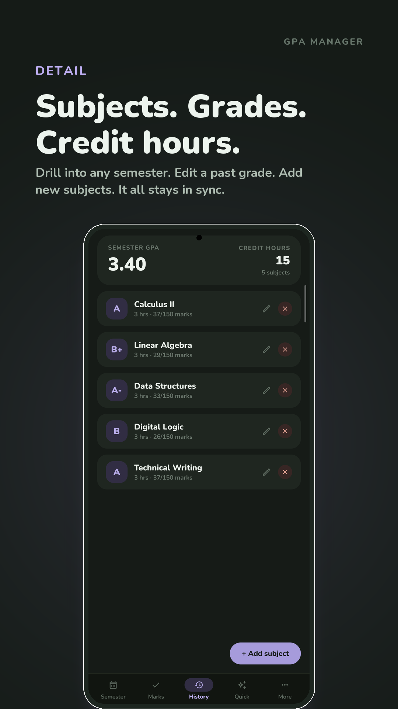
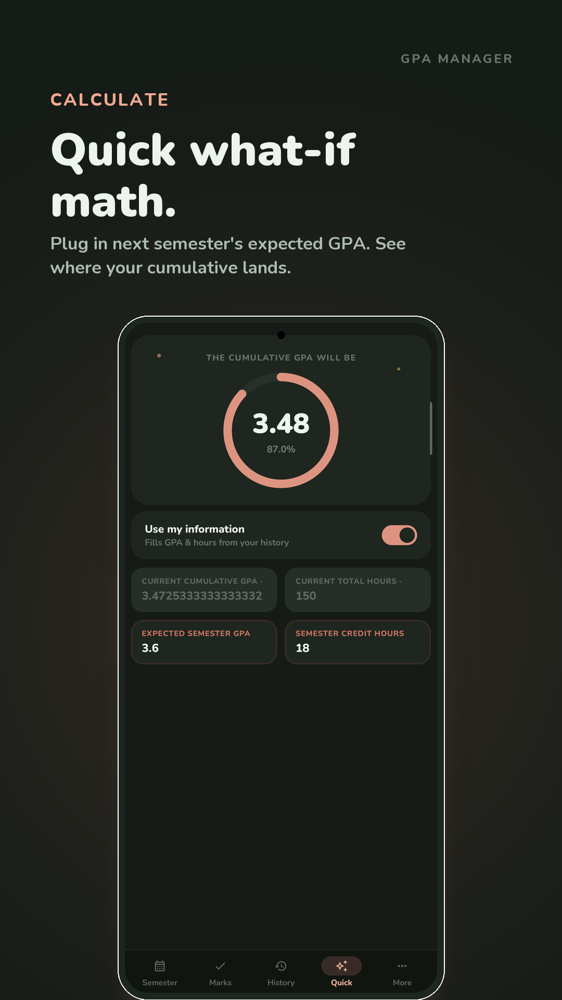
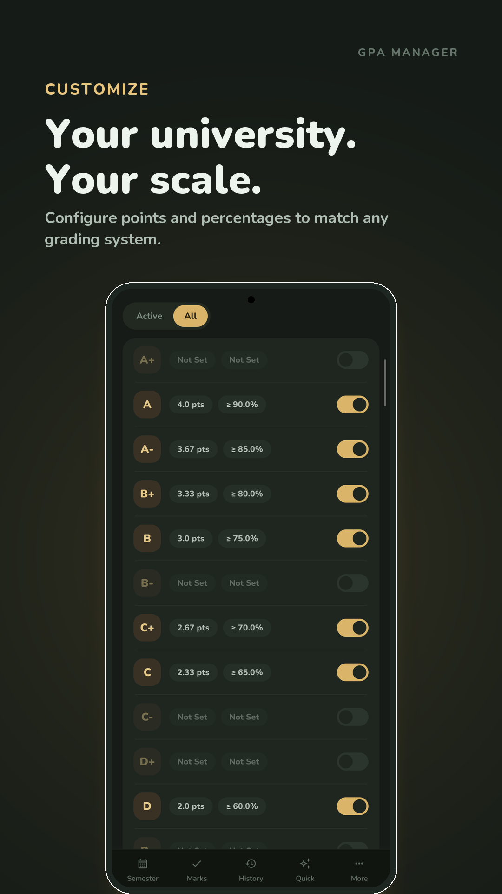
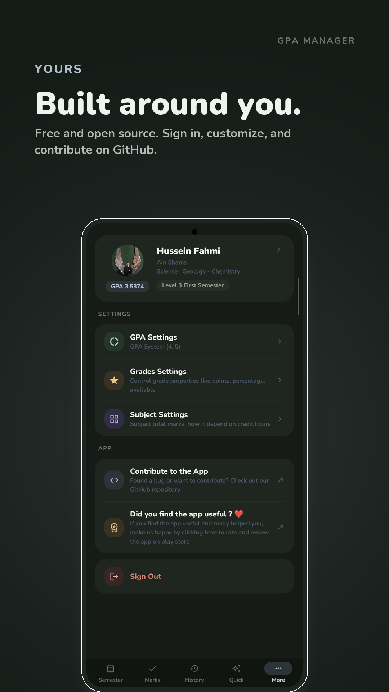

<div align="center">

# GPA Manager

**Track every semester. Know your grades before you get them.**

A GPA tracker for Android — grade calculation, semester history, and predictive planning, built with Jetpack Compose and a design system of its own.

[](https://kotlinlang.org)
[](https://android-arsenal.com/api?level=26)
[](https://developer.android.com/jetpack/compose)
[](#license)

<a href="https://play.google.com/store/apps/details?id=com.hussienFahmy.myGpaManager&hl=en">
  
</a>

<br/>
<br/>



</div>

---

## Screenshots

<table align="center">
  <tr>
    <td align="center"></td>
    <td align="center"></td>
    <td align="center"></td>
    <td align="center"></td>
  </tr>
  <tr>
    <td align="center"></td>
    <td align="center"></td>
    <td align="center"></td>
    <td></td>
  </tr>
</table>

---

## Features

- **GPA Calculation** — Tap a grade, watch the cumulative update instantly
- **Predictive Mode** — Set a target GPA and see exactly what you need next semester to hit it
- **Target Marks** — Know the minimum final-exam score needed for any grade, before you sit the exam
- **Semester History** — Your whole degree, organized year by year with full subject-level detail
- **Quick What-If Calculator** — Plug in a hypothetical semester GPA and see where your cumulative lands
- **Custom GPA Systems** — 4.0 or 5.0 scale, configurable points and percentages to match any institution
- **Firebase Sync** — Backup and restore data across devices
- **Google Sign-In** — Secure authentication with your Google account
- **Material 3 + Meadow Design System** — A cohesive, hand-tuned dark-first design system built on top of Material 3

---

## Tech Stack

| Layer | Technology |
|-------|-----------|
| Language | Kotlin |
| UI | Jetpack Compose + Material 3 |
| Architecture | Clean Architecture (multi-module) |
| DI | Koin 4 |
| Database | Room |
| Preferences | DataStore |
| Navigation | Compose Destinations |
| Backend | Firebase (Auth, Firestore, Storage) |
| Background | WorkManager |
| Image Loading | Coil |

---

## Architecture

The project follows **clean architecture** with a **feature-based multi-module** structure:

```
GPA_Manager/
├── app/                    # Main module — navigation, DI setup, WorkManager
├── core/                   # Shared utilities, models, domain logic, Koin providers
├── core-ui/                # Shared UI components and design system
├── build-logic/            # Custom Gradle plugins for consistent module config
└── feature modules/        # Each feature in its own module
    ├── grades_setting/
    ├── gpa_system_settings/
    ├── quick/
    ├── subject_settings/
    ├── semester_marks/
    ├── semester_subjctets/
    ├── onboarding/
    ├── sync/
    └── user_data/
```

Each feature module follows the layered pattern:
```
feature_name/
├── domain/        # Use cases, interfaces
├── data/          # Repositories, data sources
└── presentation/  # ViewModels, Composable screens
```

---

## Getting Started

### Prerequisites

- Android Studio Hedgehog or newer
- JDK 17+
- Android SDK with compile SDK 36

### Setup

1. **Clone the repository**
   ```bash
   git clone https://github.com/Hussienfahmy/GPA_Manager.git
   cd GPA_Manager
   ```

2. **Configure Firebase**

   The app uses Firebase for authentication and data sync. You'll need to obtain `google-services.json` files from the [Firebase Console](https://console.firebase.google.com/) and place them in:
   ```
   onboarding/onboarding_presentation/google-services.json
   user_data/user_data_data/google-services.json
   sync/sync_data/google-services.json
   ```
   > These files are excluded from version control for security reasons.

3. **Build the project**
   ```bash
   ./gradlew assembleDebug
   ```

4. **Run on a device or emulator**
   ```bash
   ./gradlew installDebug
   ```

---

## Build Commands

```bash
# Debug APK
./gradlew assembleDebug

# Release APK (minified)
./gradlew assembleRelease

# Unit tests
./gradlew test

# Instrumented tests
./gradlew connectedAndroidTest

# Lint check
./gradlew lint

# Clean build
./gradlew clean
```

---

## Contributing

Contributions are welcome! Please follow these steps:

1. **Fork** the repository
2. **Create a feature branch**
   ```bash
   git checkout -b feature/your-feature-name
   ```
3. **Follow the code style**
   - Use Kotlin idioms and coroutines
   - Follow the existing clean architecture layer separation
   - Place DI definitions in `{module}/di/Module.kt`
   - Use Koin DSL (`single`, `factory`, `viewModel`) for dependency injection
   - Use `koinViewModel()` in Composables
4. **Write tests** for new functionality where applicable
5. **Run lint and tests** before submitting
   ```bash
   ./gradlew lint test
   ```
6. **Commit** with a clear, descriptive message
7. **Open a Pull Request** with a description of your changes

### Code Style Guidelines

- Package structure: `com.hussienfahmy.{module_name}`
- Apply `base-module` plugin for new Android library modules
- Apply `base-compose-module` plugin for Compose-enabled modules
- Coroutine dispatcher injection via `named(CoreQualifiers.DEFAULT_DISPATCHER)`

---

## License

This project is licensed under the GNU General Public License v3.0 (GPL-3.0). See the LICENSE file for full details. Commercial licensing is available separately — contact the developer for inquiries.

---

## Developer

**Hussien Fahmy**
